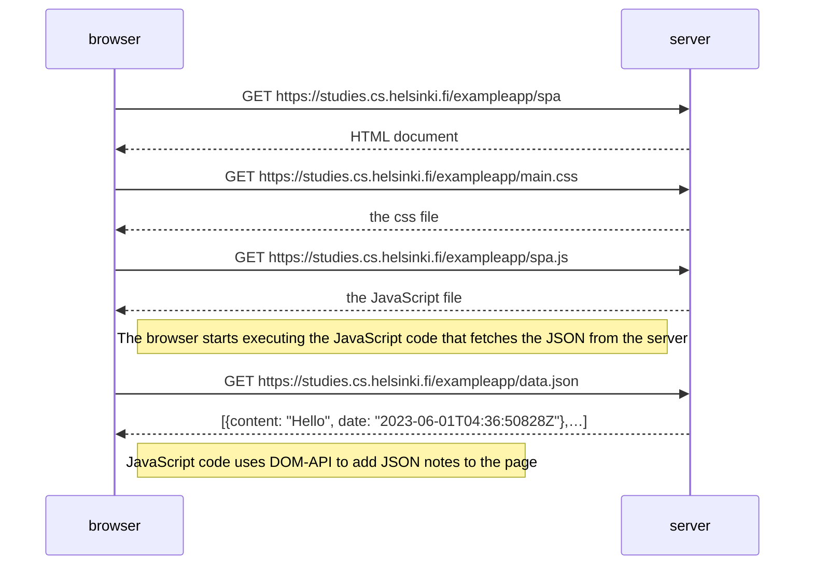

Sequence diagram on visiting the single-app page at https://studies.cs.helsinki.fi/exampleapp/spa

```mermaid
sequenceDiagram
participant browser
participant server

browser->>server: GET https://studies.cs.helsinki.fi/exampleapp/spa
server-->>browser: HTML document

browser->>server: GET https://studies.cs.helsinki.fi/exampleapp/main.css
server-->>browser: the css file

browser->>server: GET https://studies.cs.helsinki.fi/exampleapp/spa.js
server-->>browser: the JavaScript file

Note right of browser: The browser starts executing the JavaScript code that fetches the JSON from the server

browser->>server: GET https://studies.cs.helsinki.fi/exampleapp/data.json
server-->>browser: [{content: "Hello", date: "2023-06-01T04:36:50828Z"},…]
Note right of browser: JavaScript code uses DOM-API to add JSON notes to the page
```